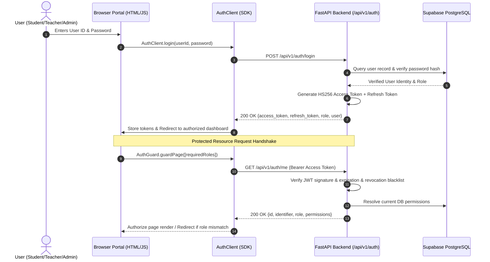

# SSGMCE College ERP — Authentication & Authorization Architecture

## 1. Overview & Architectural Principles

The SSGMCE College ERP enforces a centralized, cryptographic, and server-validated authentication and authorization architecture. It establishes **Supabase Auth and cryptographically signed JSON Web Tokens (JWTs)** as the single authoritative source of truth for user identity and role-based permissions.

### Core Architectural Directives
1. **Zero-Trust Client Storage:** Browser storage (`localStorage`, `sessionStorage`, cookies) is strictly treated as untrusted client-side memory. Modifying keys such as `user_role`, `student_id`, `teacher_id`, or `ssgmce_user` in browser DevTools grants **zero elevated privileges**.
2. **Server-Side Identity Verification:** Every protected API route cryptographically validates the incoming JWT Bearer token on the server and authoritatively resolves the user's verified role and permissions directly from the PostgreSQL database (`roles`, `user_roles`, `role_permissions`).
3. **Strict Role-Based Access Control (RBAC):** Privileges are enforced at the backend dependency level. Role escalation (e.g. Student accessing Teacher/Admin endpoints, Teacher accessing Admin endpoints) is strictly rejected with `HTTP 403 Forbidden`.
4. **Resilient Session Lifecycle:** Implements short-lived access tokens, long-lived refresh tokens with cryptographic signature rotation, and explicit server-side token revocation on logout.

---

## 2. Authentication Flow Diagram



---

## 3. Cryptographic Token Lifecycle

### 3.1 Token Types & Configuration
- **Access Token:**
  - Standard: JWT (JSON Web Token)
  - Algorithm: `HS256` (HMAC with SHA-256)
  - Key: `JWT_SECRET` (loaded exclusively from environment variables)
  - Lifespan: Default 120 minutes (`ACCESS_TOKEN_EXPIRE_MINUTES`)
  - Payload claims:
    ```json
    {
      "sub": "b319e831-c312-402f-89a7-d273c86f18c4",
      "user_id": "b319e831-c312-402f-89a7-d273c86f18c4",
      "identifier": "308637",
      "role": "student",
      "email": "shivam.aghao@ssgmce.ac.in",
      "name": "Aghao Shivam Sanjay",
      "permissions": ["student:profile:read", "student:attendance:read"],
      "type": "access",
      "exp": 1791380000,
      "iat": 1791372800
    }
    ```
- **Refresh Token:**
  - Lifespan: 7 days (`REFRESH_TOKEN_EXPIRE_DAYS`)
  - Payload claims: `{"sub": ..., "type": "refresh", "exp": ..., "iat": ...}`

### 3.2 Token Refresh Workflow
When an access token expires:
1. `AuthClient` catches HTTP 401 or detects token expiry.
2. `AuthClient.refreshSession()` sends `POST /api/v1/auth/refresh` containing `{"refresh_token": "..."}`.
3. Backend validates cryptographic signature, checks that the token type is `"refresh"`, verifies it is not revoked, and re-validates the user identity in PostgreSQL.
4. Old refresh token is blacklisted (`REVOKED_TOKENS`) and a brand-new access token and refresh token pair is issued (token rotation).

### 3.3 Session Termination & Revocation (Logout)
- Client calls `AuthClient.logout()` which sends `POST /api/v1/auth/logout` with Bearer token.
- Backend adds the access token to the server revocation set (`REVOKED_TOKENS`).
- Even if an access token has not yet mathematically expired, subsequent requests with that token are immediately rejected with `401 Unauthorized: Session has been terminated`.
- Client clears all browser session storage and redirects to `login.html`.

---

## 4. Role Hierarchy & RBAC Matrix

The system implements strict Role-Based Access Control mapped in Supabase PostgreSQL:

| Role | Description | Accessible Portals | Permissions |
| :--- | :--- | :--- | :--- |
| **Super Admin** | Complete system access | Admin, Faculty, Student portals | `*` (All permissions) |
| **Admin** | System administration & master data | `admin-dashboard.html` | `admin:manage`, `users:manage`, `audit:read`, `reports:read`, `rbac:assign` |
| **HOD** | Department Head management | `teacher-dashboard.html`, Admin Reports | Teacher permissions + `attendance:approve`, `leave:approve`, `dept:reports` |
| **Teacher / Faculty**| Course instruction & class management | `teacher-dashboard.html`, `teacher-attendance.html`, `teacher-quiz.html`, `teacher-attendance-roster.html` | `attendance:mark`, `quiz:manage`, `marks:enter`, `leaves:apply`, `timetable:read` |
| **Student** | Academic tracking & fee payment | `student-dashboard.html`, `student-profile.html`, `student-attendance.html`, `student-quiz.html`, `student_timetable.html` | `student:profile:read`, `student:attendance:read`, `student:marks:read`, `quiz:take`, `fees:pay` |

---

## 5. Security Threat Mitigation

### 5.1 Defense Against Insecure `localStorage` Tampering
- **Vulnerability Addressed:** In early iterations, frontend pages inspected `localStorage.getItem("user_role")`. An attacker could execute `localStorage.setItem("user_role", "admin")` to bypass frontend checks.
- **Enforced Solution:**
  1. `AuthGuard.guardPage(['admin'])` executes an authoritative server handshake: `GET /api/v1/auth/me`.
  2. The server ignores any client headers or query parameters and decodes the signed JWT from the `Authorization: Bearer <token>` header.
  3. The server extracts the `sub` claim and verifies the real role against the PostgreSQL database.
  4. If the server-verified role is `student`, the backend returns `role: "student"`. `AuthGuard` detects the mismatch, blocks execution, and immediately routes the client to `student-dashboard.html`.

### 5.2 Defense Against ID Tampering / Insecure Direct Object References (IDOR)
- **Vulnerability Addressed:** An authenticated student requesting `GET /api/v1/student/profile?student_code=308638` to access another student's confidential marks or attendance.
- **Enforced Solution:**
  - Route handlers use `_resolve_student_code(requested_code, current_user)`.
  - If `current_user.role == "student"`, the handler enforces `current_user.identifier`. If `requested_code` is supplied and does not match the student's authenticated ID, the backend immediately halts and raises `HTTP 403 Forbidden`: *"Access denied: Students are only permitted to access their own academic records."*

### 5.3 Defense Against Teacher Portal Access by Students
- `backend/routes/faculty.py` and `backend/routes/management.py` enforce `extract_teacher_identifier()` and `extract_actor_id()`.
- If an authorization header contains a valid token belonging to a student, any access to teacher attendance, syllabus management, leave management, or marks entry is rejected with `HTTP 403 Forbidden`.

---

## 6. Directory Structure & Key Components

```
ERP-SYSTEM/
├── backend/
│   ├── auth/
│   │   ├── __init__.py           # Package exports
│   │   ├── models.py             # Pydantic schemas (LoginPayload, AuthenticatedUser, TokenResponse)
│   │   ├── jwt_handler.py        # HS256 PyJWT encoding, decoding & claim validation
│   │   ├── service.py            # Authoritative AuthenticationService & PostgreSQL RBAC resolver
│   │   └── dependencies.py       # FastAPI route guards (get_current_user, require_role, require_admin, etc.)
│   └── routes/
│       ├── auth.py               # REST API endpoints (/login, /refresh, /logout, /me, /verify/*)
│       ├── student.py            # Student portal endpoints with identity binding
│       ├── faculty.py            # Faculty portal endpoints with role gating
│       └── management.py         # Management endpoints with strict RBAC
├── frontend/
│   ├── common/
│   │   └── auth/
│   │       ├── auth-client.js    # Client-side Auth SDK (login, logout, refresh, fetchWithAuth)
│   │       └── auth-guard.js     # Page-level guard (AuthGuard.guardPage(['teacher']))
│   └── js/
│       ├── auth.js               # Unified session manager bridge
│       └── erp-auth-guard.js     # Legacy-compatible hardened guard
└── docs/
    └── AUTHENTICATION.md         # This specification
```

---

## 7. API Endpoint Reference

### `POST /api/v1/auth/login`
- **Request Body:**
  ```json
  {
    "user_id": "308637",
    "password": "yourpassword",
    "role": "student"
  }
  ```
- **Success Response (200 OK):**
  ```json
  {
    "success": true,
    "message": "Authenticated successfully",
    "data": {
      "access_token": "eyJhbGciOi...",
      "refresh_token": "eyJhbGciOi...",
      "token_type": "bearer",
      "expires_in": 7200,
      "role": "student",
      "redirect": "student-dashboard.html",
      "user": {
        "id": "c138fd94-f203-4c91-912f-68393e887550",
        "identifier": "308637",
        "name": "Aghao Shivam Sanjay",
        "email": "shivam.aghao@ssgmce.ac.in",
        "role": "student"
      }
    }
  }
  ```

### `POST /api/v1/auth/refresh`
- **Request Body:** `{"refresh_token": "eyJhbGciOi..."}`
- **Success Response (200 OK):** Issues new `access_token` and rotated `refresh_token`.

### `POST /api/v1/auth/logout`
- **Headers:** `Authorization: Bearer <token>`
- **Success Response (200 OK):** Blacklists active token on server.

### `GET /api/v1/auth/me`
- **Headers:** `Authorization: Bearer <token>`
- **Success Response (200 OK):** Returns server-verified `AuthenticatedUser` model.

### `GET /api/v1/auth/verify/{student|teacher|admin}`
- **Headers:** `Authorization: Bearer <token>`
- **Response:** `200 OK` if authorized; `403 Forbidden` if role mismatch; `401 Unauthorized` if token invalid/missing.

