# SSGMCE COLLEGE ERP — COMPREHENSIVE ARCHITECTURAL AUDIT REPORT
**Document Reference:** `docs/ERP-AUDIT.md`  
**Institution:** Shri Sant Gajanan Maharaj College of Engineering, Shegaon  
**Date of Audit:** October 8, 2026  
**Auditor:** Autonomous Senior Systems Architect & Security Reviewer  
**Status:** COMPLETE (Audit-Only; Zero Code Modded)

---

## 1. EXECUTIVE SUMMARY & CURRENT ARCHITECTURE

The SSGMCE College ERP is an enterprise-grade academic administration, examination, and student services platform. Over several iterative phases (Steps 1 through 8), the system expanded from separate prototypes into a unified multi-portal architecture supporting **Students**, **Teachers/Faculty**, and **Administrators**.

However, rapid feature development across separate iterations has produced **architectural bifurcation**:
1. **Frontend Layer:** A primary unified frontend (`frontend/html/` with CSS and JS) operates side-by-side with three legacy/duplicate directory structures (`student/`, `faculty/`, and `Teacher_Dashboard/`).
2. **Backend API Layer:** An active unified FastAPI server (`backend/main.py`) running on port 8000 coexists with legacy launcher scripts trying to spawn a Node.js Express server on port 5001 (`Teacher_Dashboard/backend`) and a standalone faculty attendance server (`faculty/backend/attendance_api`).
3. **Database Layer:** A dual-persistence split exists where legacy endpoints query a local SQLite database (`backend/erp.db`), while modern modules (Step 5 Quiz Portal, Step 6 Academic Records & Digital Wallet, Step 7 Notifications & Real-Time Alerts, and Step 8 Management Tools) operate directly on **Supabase Cloud PostgreSQL** (`https://gftqvclenyplnuoocbwe.supabase.co`).
4. **Code Quality & Stability:** Unresolved Git merge conflict markers (`<<<<<<< HEAD`) reside inside critical frontend JavaScript files (`frontend/js/auth.js`, `frontend/js/api.js`, `frontend/js/app.js`, `frontend/js/data.js`), creating silent script execution crashes or fallback anomalies.

### High-Level Architecture Topology

```
+----------------------------------------------------------------------------------------------------+
|                                    CLIENT APPLICATION LAYER                                        |
+-----------------------------------+--------------------------------+-------------------------------+
|       STUDENT PORTAL              |       TEACHER PORTAL           |        ADMIN PORTAL           |
| frontend/html/student-dashboard   | frontend/html/teacher-dashboard| frontend/html/admin-dashboard |
| frontend/html/student-quiz        | frontend/html/teacher-quiz     | (System overview, workload,   |
| (12 integrated modules)           | frontend/html/teacher-attend.  |  approvals, RBAC matrix, logs)|
+-----------------------------------+--------------------------------+-------------------------------+
                                  |
                                  | HTTP / REST Fetch API (port 8000)
                                  v
+----------------------------------------------------------------------------------------------------+
|                         UNIFIED FASTAPI BACKEND (backend/main.py - Port 8000)                      |
+----------------------------------------------------------------------------------------------------+
|  • Inline Monolithic API Router (/api/v1 - 164 routes)                                             |
|  • Modular Routers (backend/routes/admin, faculty, attendance, student, syllabus,                  |
|    student_records, notifications, academic_wallet, management)                                    |
|  • Static Files Mounts (/html, /css, /js, /images, /student, /teacher)                             |
+----------------------------------------------------------------------------------------------------+
              |                                                                 |
              | Legacy Fallback / Direct                                        | Primary Production Data
              v                                                                 v
+-----------------------------+               +------------------------------------------------------+
|   LOCAL SQLITE (erp.db)     |               |          SUPABASE CLOUD POSTGRESQL DATABASE          |
|  (sqlite:///./erp.db)       |               |        (https://gftqvclenyplnuoocbwe.supabase.co)    |
+-----------------------------+               +------------------------------------------------------+
| • Legacy mock tables        |               | • Core ERP: students (304), teachers (15), classes,  |
| • Legacy timetable entries  |               |   subjects (15), attendance_sessions, records        |
| • Risk of data split        |               | • Step 5: quizzes, questions, options, attempts      |
+-----------------------------+               | • Step 6: student_academic_records, fee_accounts,    |
                                              |   invoices, payments, receipts, documents, certs     |
                                              | • Step 7: notifications, preferences, templates      |
                                              | • Step 8: roles, permissions, workload, audit_logs   |
                                              | • Storage Buckets: student-documents, marksheets,   |
                                              |   fee-receipts, student-certificates                 |
                                              +------------------------------------------------------+
```

---

## 2. ACTIVE FRONTEND ENTRY POINTS

### 2.1 Primary Active Pages (`frontend/html/`)
These pages represent the active, user-facing application:

| File Path | Portal Role | Description & Module Coverage | Backend Dependency |
|---|---|---|---|
| `frontend/html/login.html` | Universal | Portal landing & authentication with role selector (Student, Faculty, Admin). Synchronizes multi-token session storage. | `http://127.0.0.1:8000/api/v1/auth/login` |
| `frontend/html/student-dashboard.html` | Student | 12 integrated sections: Academic Overview, Academic Records & Grades, Subject Attendance, Live Timetable, Syllabus Tracking, Digital Fee Wallet, Digital Document Wallet, Online Quizzes, E-Learning, Exam Revaluation, Real-Time Notifications, Profile. | `/api/v1/student/*`, `/api/v1/academic-wallet/*`, `/api/v1/notifications/*` |
| `frontend/html/teacher-dashboard.html` | Teacher | 10 integrated modules: Workload Overview, Weekly Timetable, Assigned Student Directory, Quick Attendance Hub, Quiz & Assessment Creator, Internal Marks Entry, Class Analytics & Reports, Faculty Leave Applications, Notifications, Faculty Profile. | `/api/v1/management/teacher/*`, `/api/v1/teacher/*`, `/api/v1/attendance/*` |
| `frontend/html/admin-dashboard.html` | Admin / HOD | Enterprise management: Institutional Metrics, Academic Operations, Faculty Workload Allocation, Attendance Unlock/Approvals, Semester Result Publishing, Granular RBAC Permission Matrix, Audit Log Inspector. | `/api/v1/management/admin/*`, `/api/v1/management/rbac/*`, `/api/v1/management/audit/*` |
| `frontend/html/student-quiz.html` | Student | Live examination screen with server-enforced countdown timer, randomized questions, autosave, anti-cheat visibility tracking, instant auto-grading. | `/api/v1/quiz/*`, `/api/v1/student/quizzes/*` |
| `frontend/html/teacher-quiz.html` | Teacher | Complete quiz authoring suite: Question bank manager, difficulty weighting, negative marking, attempt limits, result publishing toggle, CSV export. | `/api/v1/quiz/*`, `/api/v1/teacher/quizzes/*` |
| `frontend/html/teacher-attendance.html` | Teacher | Dedicated attendance card selection interface for scheduled lectures, practical batches, and extra classes. | `/api/v1/teacher/attendance/*` |
| `frontend/html/teacher-attendance-roster.html` | Teacher | Interactive roll-call swipe/toggle roster with student cards, bulk select (All Present / All Absent), and real-time percentage indicators. | `/api/v1/teacher/class-roster`, `/api/v1/teacher/attendance/bulk` |

### 2.2 Satellite & Legacy Frontend Pages
- `frontend/html/student-attendance.html`, `frontend/html/student-profile.html`, `frontend/html/student-syllabus.html`, `frontend/html/student_timetable.html`: Early standalone prototypes that have now been absorbed into `student-dashboard.html` tabs.
- `frontend/html/teacher_timetable.html`, `frontend/html/quiz.html`: Satellite pages partially superseded by the unified dashboards.
- `frontend/html/index.html`: Landing redirect page.

---

## 3. ACTIVE BACKEND ENTRY POINTS

### 3.1 Primary Runtime
The active production backend is executed via:
```bash
python -m uvicorn backend.main:app --host 0.0.0.0 --port 8000
```
Configured in `run_backend.bat`.

### 3.2 Backend Route Organization & Shadowing Issue
The FastAPI application in `backend/main.py` has two conflicting route mounting patterns:
1. **Inline Monolithic Router (`api = APIRouter(prefix="/api/v1")`):** Contains ~164 endpoint handlers declared directly in `backend/main.py` lines 102–2776.
2. **Modular Routers (`backend/routes/*`):** Included at lines 2781–2802:
   - `admin_router` (`backend/routes/admin.py`) -> mounted at `/api/v1`
   - `faculty_router` (`backend/routes/faculty.py`) -> mounted at `/api/v1`
   - `attendance_router` (`backend/routes/attendance.py`) -> mounted at `/api/v1`
   - `student_router` (`backend/routes/student.py`) -> mounted at `/api/v1`
   - `syllabus_router` (`backend/routes/syllabus.py`) -> mounted at `/api/v1`
   - `student_records_router` (`backend/routes/student_records.py`) -> mounted at `/api/v1`
   - `notifications_router` (`backend/routes/notifications.py`) -> mounted at `/api/v1`
   - `academic_wallet_router` (`backend/routes/academic_wallet.py`) -> mounted at `/api/v1`
   - `management_router` (`backend/routes/management.py`) -> mounted at `/api/v1`

**Critical Finding:** Because both the monolithic inline router and the modular routers register handlers for overlapping paths (such as `/api/v1/attendance/...` and `/api/v1/student/...`), FastAPI matches the first registered route. Changes made to modular files in `backend/routes/` are silently shadowed or ignored if the inline route in `backend/main.py` was defined first!

---

## 4. DATABASE ARCHITECTURE

### 4.1 Canonical Cloud Database: Supabase PostgreSQL
- **Host / URL:** `https://gftqvclenyplnuoocbwe.supabase.co`
- **Database Engine:** PostgreSQL 15+ with pg_trgm, UUID-OSSP, and PostgREST.

#### Verified Cloud Tables & Data Inventory:
| Table Name | Step | Row Count | Purpose |
|---|---|---|---|
| `students` | Core | 304 | Verified institutional roster (2R1, 2R2, 3R, 4R) with SIS IDs and roll numbers. |
| `teachers` | Core | 15 | SSGMCE faculty records (CSE department) with designations, employee codes, and emails. |
| `classes` | Core | 4 | Academic classes: `2R1`, `2R2`, `3R`, `4R`. |
| `subjects` | Core | 15 | Curriculum subjects (DSA, OS, DBMS, DAA, AI, CN, SE, etc.). |
| `attendance_sessions` | Core | Active | Lecture & lab attendance sessions logged by teachers. |
| `attendance_records` | Core | Active | Per-student present/absent logs tied to attendance sessions. |
| `timetable_entries` | Core | Active | Weekly scheduled periods across classes and teachers. |
| `quizzes` | Step 5 | Active | Online quizzes and tests created by faculty. |
| `quiz_questions` | Step 5 | Active | Questions with marks, negative marking, and question type. |
| `quiz_question_options` | Step 5 | Active | Options with `is_correct` flags. |
| `quiz_attempts` | Step 5 | Active | Student test sessions with start time, submit time, duration. |
| `quiz_attempt_answers` | Step 5 | Active | Student submitted answers and awarded marks. |
| `quiz_results` | Step 5 | Active | Evaluated results with release/publish status toggle. |
| `student_academic_records` | Step 6 | Active | Semester-wise SGPA, CGPA, percentage, earned credits. |
| `student_subject_results` | Step 6 | Active | Subject-wise internal (CIE), external (ESE), practical marks and grades. |
| `student_fee_accounts` | Step 6 | Active | Fee ledger: total fees, scholarships, waivers, payable, paid, balance. |
| `fee_invoices` & `fee_payments` | Step 6 | Active | Invoices, payment transactions, and receipt numbers. |
| `student_documents` | Step 6 | Active | Verified Bonafide, marksheets, admission receipts. |
| `student_certificates` | Step 6 | Active | Digital certificates verifiable via public RPC. |
| `notifications` | Step 7 | Active | Multi-category notification ledger with read/unread flags. |
| `user_notification_preferences` | Step 7 | Active | Email, SMS, in-app notification toggles per user. |
| `roles` & `permissions` | Step 8 | Active | RBAC framework: Admin, Faculty, Student, Super Admin permissions. |
| `faculty_subject_assignments` | Step 8 | Active | Workload mapping linking teachers to subjects and classes. |
| `faculty_leave_requests` | Step 8 | Active | Teacher leave applications and approval statuses. |
| `admin_audit_logs` | Step 8 | Active | Immutable security logs tracking all administrative actions. |

### 4.2 Local SQLite Database (`backend/erp.db`)
- Created during early offline development.
- Initialized by SQLAlchemy `engine = create_engine("sqlite:///./erp.db")`.
- Contains legacy tables with seed data that does not synchronize automatically with Supabase Cloud.
- **Risk:** Several endpoints in `backend/main.py` query SQLite directly or implement fallback logic (`try Supabase else SQLite`), risking split-brain state where records saved locally are invisible to users querying the cloud.

---

## 5. AUTHENTICATION ARCHITECTURE

### 5.1 Token & Session State Flow
Authentication is managed via `frontend/js/auth.js`, `frontend/js/config.js`, and `backend/main.py`:
1. **User Sign-in:** User submits credentials at `frontend/html/login.html`.
2. **API Endpoint:** Request is posted to `/api/v1/auth/login`.
3. **Response:** Backend validates credentials against database (or returns demo user payload in offline mode) and responds with:
   ```json
   {
     "access_token": "jwt_token_string",
     "token_type": "bearer",
     "user": {
       "id": "uuid",
       "name": "Dr. J. M. Patil",
       "email": "jmpatil@ssgmce.ac.in",
       "role": "teacher",
       "emp_code": "EMP-CSE-1001",
       "department": "Computer Science & Engineering"
     }
   }
   ```
4. **Storage Synchronization:** The frontend stores authentication data in browser storage using multiple redundant keys:
   - `localStorage.setItem('ssgmce_user', JSON.stringify(user))`
   - `localStorage.setItem('ssgmce_erp_session', JSON.stringify(session))`
   - `localStorage.setItem('ssgmce_active_role', user.role)`
   - `localStorage.setItem('ssgmce_teacher_token', token)` (for faculty)
   - `localStorage.setItem('ssgmce_student_token', token)` (for students)
   - Redundantly duplicated into `sessionStorage` for cross-tab persistence.
5. **Route Protection (`frontend/js/erp-auth-guard.js`):** Every dashboard runs a client-side auth guard that inspects `localStorage` on page load. If missing or role mismatches, redirects user to `login.html`.

### 5.2 Unresolved Merge Conflict in Auth Flow
In `frontend/js/auth.js` (lines 150–158):
```javascript
if (role === 'teacher' || role === 'faculty') {
  localStorage.setItem(STORAGE_TEACHER_TOKEN, token);
<<<<<<< HEAD
  localStorage.setItem('ssgmce_active_teacher', userJson);
  if (user.emp_code || user.empCode) {
    localStorage.setItem('ssgmce_selected_faculty', user.emp_code || user.empCode);
  }
=======
  sessionStorage.setItem(STORAGE_TEACHER_TOKEN, token);
>>>>>>> fd7760bf814784b37a85b715e43aae31ce38985e
}
```
This syntax breaks JS execution in browsers that parse `auth.js` strictly, resulting in failed teacher login state initialization.

---

## 6. MODULE INVENTORY & STATUS

| Module Name | Implementation Location | Database Store | Status |
|---|---|---|---|
| **Authentication & RBAC** | `frontend/js/auth.js`, `backend/routes/auth.py`, `backend/main.py` | Supabase `roles`, `permissions`, `user_roles` | Functional, needs merge conflict fix & token unification |
| **Student Academic Records** | `student-dashboard.js`, `academic_wallet_service.py` | Supabase `student_academic_records`, `student_subject_results` | Production Ready (Step 6) |
| **Student Attendance View** | `student-dashboard.js`, `attendanceService.js` | Supabase `student_attendance_subjects`, `attendance_records` | Production Ready (Step 6) |
| **Digital Fee Wallet** | `student-dashboard.js`, `academic_wallet.py` | Supabase `student_fee_accounts`, `fee_invoices`, `fee_payments` | Production Ready (Step 6) |
| **Digital Document Wallet** | `student-dashboard.js`, `backend/routes/student_records.py` | Supabase `student_documents`, `student-documents` bucket | Production Ready (Step 6) |
| **Digital Certificates & QR** | `student-dashboard.js`, `verify_student_certificate` RPC | Supabase `student_certificates`, public verification RPC | Production Ready (Step 6) |
| **Teacher Attendance Hub** | `teacher-attendance.html`, `attendance.js`, `backend/main.py` | Supabase `attendance_sessions`, `attendance_records` | Production Ready (Step 4 & 8) |
| **Online Quiz / Exams** | `teacher-quiz.html`, `student-quiz.html`, `quiz-api.js` | Supabase `quizzes`, `quiz_questions`, `quiz_attempts` | Production Ready (Step 5) |
| **Notifications & Alerts** | `student-api.js`, `notifications.py`, `notification_service.py` | Supabase `notifications`, `user_notification_preferences` | Production Ready (Step 7) |
| **Teacher Workload & Leave** | `teacher-dashboard.html`, `management.py`, `management_service.py`| Supabase `faculty_subject_assignments`, `faculty_leave_requests` | Production Ready (Step 8) |
| **Admin Management & Audit** | `admin-dashboard.html`, `management.py`, `admin_service.py` | Supabase `admin_audit_logs`, `get_admin_dashboard` RPC | Production Ready (Step 8) |

---

## 7. DUPLICATE & ORPHANED MODULES

The repository contains extensive duplication from earlier development stages:

### 7.1 Orphaned Subdirectories
1. **`Teacher_Dashboard/` (Complete Parallel Node.js Application):**
   - Contains a separate Express backend (`Teacher_Dashboard/backend/server.js`, 15 controllers, 15 route files, Prisma schemas, 10 services).
   - Contains a duplicate frontend (`Teacher_Dashboard/frontend/index.html` — 105 KB, React components, CSS).
   - **Status:** Orphaned. The active system runs on FastAPI port 8000. `Teacher_Dashboard` is not used by the unified system, but batch scripts (`start_all_servers.bat`, `start_teacher_backend.bat`) still reference it.
2. **`faculty/` (Legacy Standalone Faculty Backend & Frontend):**
   - `faculty/backend/attendance_api/`: Standalone FastAPI attendance API.
   - `faculty/frontend/attendance/`: Standalone HTML/CSS/JS attendance roster.
   - **Status:** Orphaned. Fully superseded by `frontend/html/teacher-attendance.html` and `backend/main.py`.
3. **`student/` (Legacy Standalone Student UI):**
   - `student/frontend/dashboard/index.html`, `student/timetable/`.
   - **Status:** Orphaned. Fully superseded by `frontend/html/student-dashboard.html`.
4. **`student_attandance/` (Typo Directory):**
   - Contains `student_attandance/frontend/index.html` (0 bytes, empty).
   - **Status:** Completely empty and unused.

### 7.2 Duplicate JavaScript Files in `frontend/js/`
- Attendance handling is fragmented across multiple scripts:
  - `attendance.js` (Active attendance controller)
  - `attendanceApp.js` (Legacy wrapper)
  - `attendanceCalculations.js` (Math utilities)
  - `attendanceData.js` (Offline mock data)
  - `attendanceService.js` (Supabase direct fetch client)
  - `teacher-attendance.js`
  - `teacher-attendance-app.js`
  - `teacher-attendance-roster.js`
  - `teacher-attendance-service.js`
  - `teacher-attendance-api.js`
- API Clients:
  - `api.js` (Legacy client probing port 5001 and 8000)
  - `admin-api.js`, `teacher-api.js`, `student-api.js`, `quiz-api.js` (Active domain-specific clients)

---

## 8. DETAILED DEPENDENCY MAP

```mermaid
flowchart TD
    subgraph Frontend["Frontend Client Layer (Browser)"]
        Login["frontend/html/login.html"]
        StudentDash["frontend/html/student-dashboard.html"]
        TeacherDash["frontend/html/teacher-dashboard.html"]
        AdminDash["frontend/html/admin-dashboard.html"]
        QuizUI["frontend/html/student-quiz.html & teacher-quiz.html"]
        AttendUI["frontend/html/teacher-attendance*.html"]
    end

    subgraph ClientJS["Client Services & API Adapters"]
        AuthJS["frontend/js/auth.js + erp-auth-guard.js"]
        ConfigJS["frontend/js/config.js"]
        StudentAPI["frontend/js/student-api.js"]
        TeacherAPI["frontend/js/teacher-app.js / teacher-api.js"]
        AdminAPI["frontend/js/admin-api.js / admin-dashboard.js"]
        QuizAPI["frontend/js/quiz-api.js"]
        AttendAPI["frontend/js/attendance.js / teacher-attendance-api.js"]
        SupaDirect["frontend/js/erp-supabase.js / attendanceService.js"]
    end

    subgraph BackendAPI["Unified FastAPI Backend (Port 8000)"]
        MainApp["backend/main.py"]
        AuthRoute["/api/v1/auth/login"]
        StudentRoute["/api/v1/student/*"]
        AcademicRoute["/api/v1/academic-wallet/*"]
        ManageRoute["/api/v1/management/*"]
        AttendRoute["/api/v1/attendance/* & /api/v1/teacher/attendance/*"]
        QuizRoute["/api/v1/quiz/* & /api/v1/quizzes/*"]
        NotifyRoute["/api/v1/notifications/*"]
    end

    subgraph BackendServices["Backend Services Layer"]
        AuthSvc["backend/services/auth_service.py"]
        AcadSvc["backend/services/academic_wallet_service.py"]
        ManageSvc["backend/services/management_service.py"]
        AttendSvc["backend/services/attendance_service.py"]
        QuizSvc["backend/services/quiz_service.py"]
        NotifySvc["backend/services/notification_service.py"]
    end

    subgraph DataStore["Data & Persistence Layer"]
        SupabaseCloud[("Supabase Cloud PostgreSQL (gftqvclenyplnuoocbwe)")]
        SupabaseStorage[("Supabase Storage Buckets (student-documents, etc.)")]
        LocalSQLite[("Local SQLite (backend/erp.db) [Legacy Fallback]")]
    end

    Login --> AuthJS --> AuthRoute --> AuthSvc --> SupabaseCloud
    StudentDash --> StudentAPI & ConfigJS --> StudentRoute & AcademicRoute & NotifyRoute
    StudentDash --> SupaDirect -.->|Direct PostgREST REST| SupabaseCloud
    TeacherDash --> TeacherAPI --> ManageRoute & AttendRoute & NotifyRoute
    AdminDash --> AdminAPI --> ManageRoute
    QuizUI --> QuizAPI --> QuizRoute --> QuizSvc --> SupabaseCloud
    AttendUI --> AttendAPI --> AttendRoute --> AttendSvc --> SupabaseCloud

    StudentRoute --> AcadSvc --> SupabaseCloud
    AcademicRoute --> AcadSvc --> SupabaseCloud
    ManageRoute --> ManageSvc --> SupabaseCloud
    AttendRoute --> AttendSvc --> SupabaseCloud & LocalSQLite
    NotifyRoute --> NotifySvc --> SupabaseCloud

    AcadSvc --> SupabaseStorage
```



---

## 9. SECURITY RISKS & INTEGRATION VULNERABILITIES

### 9.1 Secrets & Credential Exposure (CRITICAL)
1. **Full `service_role` Secret Stored in Plaintext:**
   - File: `supabase_keys.json` (line 12):
     `"api_key": "eyJhbGciOiJIUzI1NiIsInR5cCI6IkpXVCJ9...0CNTyl3HMiyYVhSPdQEhq_4LUYUVOY29aAAOLHwxEt4"`
   - The Supabase `service_role` key grants administrative access to the entire database, bypassing Row Level Security (RLS). This file is unencrypted in the repository root.
2. **Anonymous Key in Client Code:**
   - Files: `frontend/js/config.js` (line 36), `frontend/js/supabaseClient.js`, `backend/.env`.
   - While `anon` keys are meant for public client access, direct frontend PostgREST queries must be protected by strict RLS policies.
3. **Corrupted Root `.env`:**
   - File: `.env` (root directory).
   - Lines 3–6 contain copied terminal output (`PS D:\ERP-SYSTEM> npx supabase start ... failed to inspect container health ...`). This causes syntax errors in standard `.env` parsers.

### 9.2 Git Merge Conflict Markers in Executable Files (CRITICAL)
The following active code files contain unmerged Git conflict markers (`<<<<<<< HEAD` / `=======` / `>>>>>>>`):
- `frontend/js/auth.js`: Line 151 (breaks faculty token/session storage)
- `frontend/js/api.js`: Line 108 & 154 (breaks default credentials & request logic)
- `frontend/js/app.js`: Line 268 & 315 (breaks initialization logic)
- `frontend/js/data.js`: Line 141 & 2488 (breaks mock data structures)
- `Teacher_Dashboard/frontend/js/api.js`, `app.js`, `attendance.js`, `data.js`

### 9.3 Authorization & Identity Spoofing Risks (HIGH)
- In several attendance and student endpoints, identity is verified solely using request headers (`X-Teacher-Id`, `X-Emp-Code`) or URL query parameters (`?student_code=308637`) without validating the cryptographic signature of the Bearer JWT token on the server.
- Any client could theoretically pass another user's `student_code` or `emp_code` to read their academic records or submit attendance.

### 9.4 Offline Fallback Bypasses (HIGH)
- In `frontend/js/auth.js` and `frontend/js/login.js`, when the backend does not respond within a timeout, the frontend triggers `DEMO_USERS` fallback, automatically logging in test users with synthetic mock credentials.
- In production, a temporary backend glitch should show a connection error rather than silently degrading into synthetic mock mode.

---

## 10. INTEGRATION PROBLEMS & CODE SHADOWING

1. **Dual Routing Shadowing in `backend/main.py`:**
   - `backend/main.py` defines 164 inline routes on `api = APIRouter(prefix="/api/v1")`, and later includes `backend.routes.*` on `/api/v1`.
   - When endpoints have matching paths, FastAPI serves the first one declared, creating confusion during development and making modular route files appear unresponsive to updates.
2. **Port 5001 Probe Latency:**
   - `frontend/js/api.js` (lines 66–105) contains a fallback probe that attempts to query `http://localhost:5001/health` (the old Node.js backend). If the Node.js server is not running, the browser waits for connection timeout before failing over, introducing UI latency on startup.
3. **Dual Persistence Divergence (SQLite vs Supabase Cloud):**
   - In `backend/services/attendance_service.py` and `backend/routes/attendance.py`, some queries attempt to read from Supabase and fall back to SQLite `SessionLocal()`. This can lead to split data where attendance taken on one machine is missing from cloud queries.

---

## 11. FILE RETENTION POLICY

### 11.1 Files That Must NEVER Be Removed (Core System Assets)
These files constitute the working production system and must remain intact:

- **Unified Backend:**
  - `backend/main.py`
  - `backend/config/*` (`database.py`, `settings.py`)
  - `backend/routes/*` (`admin.py`, `faculty.py`, `attendance.py`, `student.py`, `syllabus.py`, `student_records.py`, `notifications.py`, `academic_wallet.py`, `management.py`, `auth.py`, `profile.py`, `quiz.py`)
  - `backend/services/*` (`academic_wallet_service.py`, `admin_service.py`, `attendance_service.py`, `auth_service.py`, `faculty_service.py`, `management_service.py`, `notification_service.py`, `quiz_service.py`, `student_service.py`, `syllabus_service.py`)
  - `backend/models/*`, `backend/schemas/*`, `backend/utils/*`
  - `backend/requirements.txt`, `backend/.env`
- **Active Frontend:**
  - `frontend/html/` (`login.html`, `student-dashboard.html`, `teacher-dashboard.html`, `admin-dashboard.html`, `student-quiz.html`, `teacher-quiz.html`, `teacher-attendance.html`, `teacher-attendance-roster.html`)
  - `frontend/css/*` (All dashboard stylesheets, modules, layouts, variables)
  - `frontend/js/*` (`config.js`, `auth.js`, `erp-auth-guard.js`, `student-api.js`, `student-dashboard.js`, `teacher-app.js`, `admin-dashboard.js`, `admin-api.js`, `quiz-api.js`, `attendance.js`, `teacher-attendance-roster.js`)
  - `frontend/images/*`, `frontend/assets/*` (SSGMCE logos, college photos)
- **Source Data:**
  - `DATA/*` (`2R2-26-27-Roll-list-updated-21_july-2026.xlsx`, `3R-26-27-Roll-list-updated-21_july-2026.xlsx`, `4R-Roll_list Autumn 2026-27 (17-06-26).xlsx`, `Final Roll List (2R1).pdf`, `Personal Timtable for teacher.pdf`, `Roll list 2R1.pdf`)
- **Database Migrations & Verification:**
  - `backend/supabase_step5_quiz_schema.sql`
  - `backend/supabase_step6_academic_wallet_schema.sql`
  - `backend/supabase_step7_notifications_schema.sql`
  - `backend/supabase_step8_teacher_admin_schema.sql`
  - `backend/verify_step5_quiz_db.py`, `backend/verify_step6_academic_wallet.py`, `backend/verify_step7_notifications.py`, `backend/verify_step8_schema.py`
  - `run_backend.bat`

### 11.2 Files & Directories Safe to Deprecate / Remove (Legacy / Duplicate)
*Note: Per user instructions, no files are removed during this audit step. These are cataloged for scheduled decommission.*

- **Directories:**
  - `student_attandance/` (0-byte empty file with folder typo)
  - `faculty/` (Orphaned attendance prototype superseded by `frontend/html/teacher-attendance.html` and `backend/main.py`)
  - `student/` (Orphaned split UI superseded by `frontend/html/student-dashboard.html`)
  - `Teacher_Dashboard/` (50+ file duplicate Node.js / Express / Prisma app superseded by FastAPI port 8000)
- **Files:**
  - `start_all_servers.bat` (Attempts to launch nonexistent port 5001 Node.js and port 8001 student servers)
  - `start_teacher_backend.bat` (Launches deprecated Node.js backend)
  - `START_BACKEND.bat` (Points to missing `student\dashboard\backend`)
  - `supabase_keys.json` (Unencrypted plain-text credentials; should be migrated into secure `.env`)

---

## 12. RECOMMENDED MIGRATION ORDER

To modernize and clean the codebase safely without breaking any working features, execute changes in the following sequence:

```
Phase 1: Code Integrity & Conflict Elimination (Fix Merge Conflicts)
   │
   ▼
Phase 2: Configuration & Secret Sanitization (Clean .env, Secure Keys)
   │
   ▼
Phase 3: Router Deduplication in backend/main.py (Route Precedence & Cleanup)
   │
   ▼
Phase 4: SQLite-to-Supabase Unification (Remove split-brain fallback)
   │
   ▼
Phase 5: Client API Consolidation (Remove port 5001 probe, unify fetchers)
   │
   ▼
Phase 6: Archive & Remove Orphaned Directories (faculty/, student/, Teacher_Dashboard/)
```

---

## 13. PRIORITIZED RISK & ACTION BACKLOG

### 🔴 CRITICAL (Must Address First)
1. **Resolve Merge Conflicts in Frontend Code:**
   - Remove conflict markers in `frontend/js/auth.js` (line 151), `frontend/js/api.js` (lines 108, 154), `frontend/js/app.js` (lines 268, 315), and `frontend/js/data.js` (lines 141, 2488).
   - Ensure teacher token storage and login methods execute cleanly without throwing JavaScript parse errors.
2. **Secure Leaked `service_role` Key:**
   - Remove `supabase_keys.json` from git tracking and store credentials exclusively in `.env` (gitignored).
   - Ensure the `service_role` key is accessible only to backend server processes and never delivered to client browsers.
3. **Repair Corrupted Root `.env`:**
   - Strip the terminal prompt text (`PS D:\ERP-SYSTEM> npx supabase start ...`) from `.env` to prevent environment parsing failures.

### 🟠 HIGH (Architecture & Reliability)
1. **Backend Route Deduplication (`backend/main.py`):**
   - Consolidate inline routes in `backend/main.py` with their modular counterparts in `backend/routes/`.
   - Eliminate route shadowing so each API endpoint has a single source of truth.
2. **Server-Side Token Verification:**
   - Enforce Bearer JWT validation on sensitive endpoints rather than relying on unverified headers (`X-Teacher-Id`, `X-Emp-Code`) or query parameters (`student_code`).
3. **Disable Unintended Offline Mock Mode:**
   - Prevent `auth.js` from auto-logging into mock demo accounts when the network is momentarily unavailable, providing clear offline/connectivity alerts instead.

### 🟡 MEDIUM (Performance & Maintenance)
1. **Remove Port 5001 Fallback Probe:**
   - Remove latency-inducing `fetch('http://localhost:5001/health')` probes in `frontend/js/api.js`. Target FastAPI port 8000 directly.
2. **Phase Out Local SQLite (`backend/erp.db`):**
   - Migrate any remaining queries in `backend/routes/attendance.py` and `backend/main.py` to use Supabase Cloud PostgreSQL directly, ensuring complete data consistency across all devices.
3. **Consolidate Attendance JavaScript Files:**
   - Unify overlapping attendance scripts (`attendance.js`, `teacher-attendance.js`, `teacher-attendance-service.js`) into cohesive client modules.

### 🟢 LOW (Cleanliness & Hygiene)
1. **Archive Legacy Directories:**
   - Archive or remove orphaned directories: `student_attandance/`, `faculty/`, `student/`, and `Teacher_Dashboard/`.
2. **Standardize Launcher Batch Scripts:**
   - Update batch files so `run_backend.bat` is the sole canonical launcher, and retire obsolete multi-server scripts.
3. **Documentation:**
   - Maintain up-to-date schema definitions and API documentation in `docs/`.

---
*Audit Completed Successfully. Zero project source code or database tables were modified during this step.*

