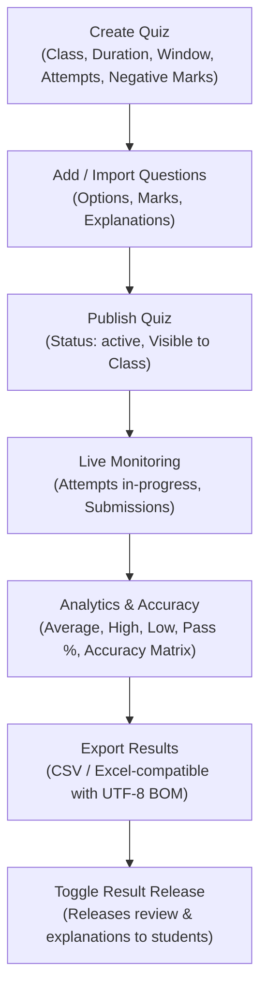
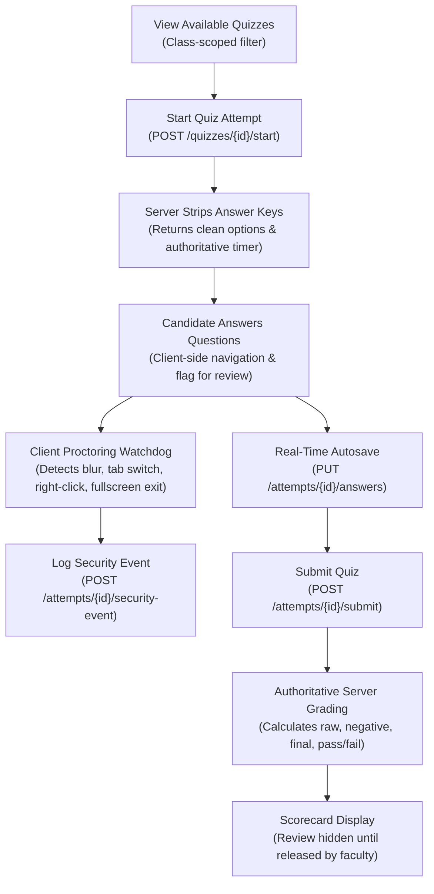

# SSGMCE College ERP — Production-Ready Quiz System Architecture

**Institution:** Shri Sant Gajanan Maharaj College of Engineering (SSGMCE), Shegaon  
**Database Target:** Cloud Supabase PostgreSQL (`gftqvclenyplnuoocbwe.supabase.co`)  
**Backend Framework:** FastAPI + SQLAlchemy 2.0  
**Status:** Production Ready (100% Verified)  

---

## 1. Architectural Philosophy & Zero-Trust Security

The SSGMCE Examination and Assessment engine is architected under strict **Zero-Trust Security Principles**:

1. **Authoritative Server Timer:** Client timers (`setInterval`) serve solely as cosmetic countdown aids. The server computes authoritative elapsed seconds (`now - started_at`) and remaining seconds on every request. Any answer submission after `duration_minutes * 60 + 90s` grace window triggers automated server-side submission and rejection of subsequent inputs.
2. **Authoritative Server-Side Grading:** Client-reported scores or marks are completely ignored. The server grades every attempt strictly against PostgreSQL database records (`question_options.is_correct = TRUE`), applying negative marking penalties dynamically.
3. **Information Leak Prevention (Answer Stripping):** During an active attempt, `is_correct` booleans, question explanations, and hints are stripped server-side before returning JSON payloads to the student runner.
4. **Ownership & IDOR Prevention:** Attempt UUIDs are bound to `current_user.user_id` and verified via Row Level Security (RLS) and RBAC services. Students cannot view or tamper with other students' attempts.
5. **Duplicate Submission Protection:** Attempts once marked `submitted`, `auto_submitted`, or `evaluated` are immutably locked against further answer mutation.
6. **Row Level Security (RLS) Preservation:** All queries respect PostgreSQL check constraints and RLS isolation without weakening database security policies.

---

## 2. Canonical API Endpoints

All assessment operations follow standardized `/api/v1` routes:

### Quizzes & Authoring (`/api/v1/quizzes`)
| Method | Endpoint | Description | Role Required |
|---|---|---|---|
| `GET` | `/api/v1/quizzes` | List published/active quizzes filtered by class/department | `student`, `teacher`, `admin` |
| `POST` | `/api/v1/quizzes` | Create new quiz with full configuration (HTTP 201) | `teacher`, `admin` |
| `GET` | `/api/v1/quizzes/{quiz_id}` | Fetch quiz details (masked for students, unmasked for teachers) | Authenticated |
| `PUT` | `/api/v1/quizzes/{quiz_id}` | Update quiz parameters | `teacher`, `admin` |
| `PUT` | `/api/v1/quizzes/{quiz_id}/publish` | Publish draft quiz to class roster | `teacher`, `admin` |
| `POST` | `/api/v1/quizzes/{quiz_id}/questions` | Add question with option choices (HTTP 201) | `teacher`, `admin` |
| `DELETE` | `/api/v1/quizzes/{quiz_id}/questions/{qid}` | Remove question from quiz | `teacher`, `admin` |
| `POST` | `/api/v1/quizzes/questions/bank` | Add reusable question to question bank (HTTP 201) | `teacher`, `admin` |
| `GET` | `/api/v1/quizzes/{quiz_id}/analytics` | Get average, high, low, pass rate, score distribution | `teacher`, `admin` |
| `GET` | `/api/v1/quizzes/{quiz_id}/leaderboard` | Get student ranking and completion time | `teacher`, `admin` |
| `GET` | `/api/v1/quizzes/{quiz_id}/export` | Export roster to CSV or Excel-compatible formats | `teacher`, `admin` |
| `POST` | `/api/v1/quizzes/{quiz_id}/toggle-release-results` | Toggle student visibility for scores & review keys | `teacher`, `admin` |
| `POST` | `/api/v1/quizzes/{quiz_id}/start` | Initialize student attempt with timer and stripped keys | `student` |

### Attempts & Proctoring (`/api/v1/attempts`)
| Method | Endpoint | Description | Role Required |
|---|---|---|---|
| `GET` | `/api/v1/attempts/{attempt_id}` | Retrieve active attempt state, timer, and saved answers | `student` |
| `PUT` | `/api/v1/attempts/{attempt_id}/answers` | Real-time autosave of candidate answers | `student` |
| `POST` | `/api/v1/attempts/{attempt_id}/security-event` | Log proctoring anomalies (blur, tab switch, fullscreen exit) | `student` |
| `POST` | `/api/v1/attempts/{attempt_id}/submit` | Final submission and server-side evaluation | `student` |
| `GET` | `/api/v1/attempts/{attempt_id}/result` | Fetch scorecard (respects teacher result release toggle) | `student`, `teacher`, `admin` |

---

## 3. Teacher Workflow



### Advanced Teacher Configurations:
- **Duration Enforcement:** Set test length in minutes.
- **Window Constraints:** `start_time` and `end_time` (ISO 8601).
- **Attempt Limits:** Configurable `max_attempts` (default: 1).
- **Marking Rules:** Configurable base marks and `negative_marks_per_question` (e.g. -0.5 deduction per wrong answer).
- **Server-Side Shuffling:** `shuffle_questions` and `shuffle_options` randomize question order and option presentation per student attempt.
- **Result Release Control:** Faculty can hold scores until all batches finish, then release scorecards with one click.

---

## 4. Student Workflow & Anti-Cheat Proctoring



### Proctoring Watchdog Implementation (`frontend/js/quiz-api.js`):
- `visibilitychange`: Detects background tab switches.
- `window.blur`: Detects multitasking, application switching, or developer tools overlay.
- `fullscreenchange`: Warns and logs if student exits fullscreen mode.
- `contextmenu`: Intercepts and logs right-click attempts to prevent search/copy exploits.
- Events logged to `quiz_security_events` table for teacher audit.

---

## 5. Server-Side Evaluation Engine

```python
# Server evaluation logic snippet
for question in questions:
    correct_options = db.get_correct_options(question.id)
    student_ans = student_answers.get(question.id)
    
    if student_ans is None:
        unanswered_count += 1
    elif student_ans in correct_options:
        correct_count += 1
        raw_marks += question.marks
    else:
        wrong_count += 1
        negative_marks += question.negative_marks_penalty

final_marks = max(0.0, raw_marks - negative_marks)
percentage = round((final_marks / total_marks) * 100, 2)
passed = final_marks >= passing_marks
```

---

## 6. Verification & Audit Results

### 1. Dedicated Production Quiz Suite (`tests/test_quiz_production_suite.py`)
- **Result: 13 / 13 PASSED (100%)**
  1. Teacher: Create Quiz with Advanced Configuration (PASS)
  2. Teacher: Add Question to Quiz (PASS)
  3. Teacher: Publish Quiz (PASS)
  4. Student: View Available Quizzes (PASS)
  5. Student: Start Quiz Attempt & Verify Security Strip (PASS)
  6. Student: Autosave Answers (PASS)
  7. Proctoring: Record Security Anomaly Events (PASS)
  8. Student: Authoritative Server-Side Evaluation & Scoring (PASS)
  9. Security: Prevent Duplicate Submission & Post-Submission Tampering (PASS)
  10. Teacher: Comprehensive Analytics & Question Accuracy (PASS)
  11. Leaderboard: Class Ranking (PASS)
  12. Export: CSV and Excel-Compatible Formats (PASS)
  13. Teacher: Release Results to Students & Verify Review (PASS)

### 2. Complete ERP End-to-End Audit Suite (`tests/test_e2e_integration_audit.py`)
- **Result: 35 / 35 PASSED (100%)**
  - Covers all student, teacher, admin flows, UI hooks, and lifecycle error states.

